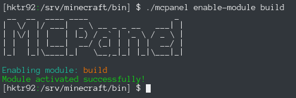
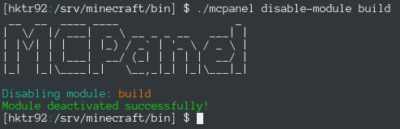
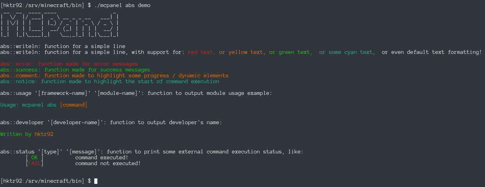

MCPanel
=======

This utility was written in order to manage a Minecraft server in my computer.


MCPanel version: 2.1.0

MCPanel channel: stable

## Features
- free and open source software;
- completely modular;
- nice output;
- easy to configure;

## Requirements:
- mandatory:
  - [ ] bash 4.0+
  - [ ] figlet
  - [ ] Java 7

- optional:
  - [ ] midnight commander

--------

#### Alpha feature: It's FOSS!
Because this software is free and open source, anyone can use, extend, adapt, fork and publish this software.
Free and Open Source Software (referred as FOSS) is always secure and anybody can see what this program does!

#### It's modular!
MCPanel is completely modular, so you can add your own extensions as you like. You must create a shell script
into `modules/available` directory, with prefix `mcp-` and suffix `.sh`. It **must** contain the following
structure:
```shell
function mcpanel::MODULE_NAME::info
{
  # module usage
  abs::notice "Usage: mcpanel MODULE_NAME [command]"

  # prints blank line
  abs::writeln

  # you must list command name and what it does under following form
  abs::writeln "Available commands:"
  abs::info "command-one" "this command does X"
  abs::info "command-two" "this command does Y"
  abs::info "help" "Shows this message"
  abs::writeln

  # This line is for developer / author. You must write your name here!
  abs::developer "hktr92"
}

function mcpanel::MODULE_NAME::command_one
{
  # command-one code
}

function mcpanel::MODULE_NAME::command_two
{
  # ...
}

function mcpanel::MODULE_NAME::main
{
  # first parameter passed to this function represents the command executed
  local command=$1

  case $command in
    # case command-one, we call command_one function
    command-one)  mcpanel::MODULE_NAME::command_one;;
    # you can pass parameters to the command if you like
    command-two) mcpanel::MODULE_NAME::command_two $2;;
    # if nothing is provided as command, prints the commands sheet
    help|*) mcpanel::MODULE_NAME::info;;
  esac
}
```

After that, you must execute a command to enable the module, which is `mcpanel enable-module [MODULE_NAME]`
and a symlink will be created into `modules/enabled` directory. You don't have anything else to do!



If the script you wrote fails, you can disable the module using `mcpanel disable-module [MODULE_NAME]`



>**NEW FEATURE!** Since 2.2.0, you can add your own configuration file for your module. You **must** create a file in `[MCPANEL_ROOT]/etc` directory.
Filename **must** respect following format: `mcp-[MODULE_NAME].cnf`, where `[MODULE_NAME]` is the name of your module

#### Nice output
I wrote Awesome Bash Stylizer (short: ABS) in order to help me have a nice output. You can demo it:

    $ mcpanel enable-module abs
    $ mcpanel abs demo

This is an approximate output:


#### Easy to configure
You have to edit *only* `core/mcpanel/mcpanel.cnf` for this task!

#### IP address synchronization
Because my router is malfunctioning, it gives me random internal IP address (e.g.: now it's 192.168.1.2, after a while it becomes 192.168.1.6, and so on), I wrote a function that synchronizes `server.properties` with three levels of IP addresses: local (which is, 127.0.0.1), lan (which is taken from `hostname` command), public (which is queried using `dig`). I've updated this function in the last moment, so I don't know exactly if this works for public IP (as I can't test it). Please feel free to submit issue with this.

--------

#### Included modules
I personally developed and included two modules: build and server.

The `build` module downloads [BuildTools](https://www.spigotmc.org/wiki/buildtools/) automatically into `process/build` directory.
Then, the binary is copied from `process/build` into `process/server`.

The `server` module executes the `process/server/server_launcher.jar`.
It haves commands like `edit`, which allows you edit `server.properties` using your favorite text editor, `$EDITOR` (cli-mode only).
Another command is `logs`, which `tail`s the `process/server/logs/latest.log` in order to see what is wrong with your server.
Also, there's a command called `explore`, which works perfectly on (almost) any desktop environment. It opens the associated file explorer using `xdg-open` and you can browse server contents. It won't work if you're not having a DE, unless you have an utility called "Midnight Commander" (known as `mc`). You'll be prompted if you like to explore the server using that utility.

#### How it works?
Modules are automatically `source`d from `modules/enabled` when you execute the `module`'s name.
After that, the `main` function under `mcpanel::${module}` namespace is loaded, and `${command}` argument is passed automatically.

#### Why version 2.0?
It's because the first version was made in haste and used for a very long time. I decided to rewrite that one, which was versioned 1.x. I'll upload that code very soon, on a different branch!

#### License
MCPanel is licensed under MIT license.
